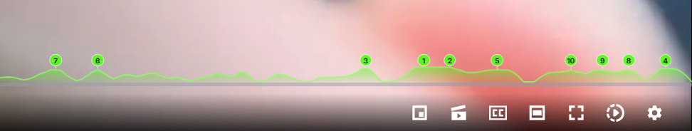
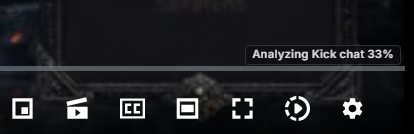

# Twitch & Kick Chat Heatmap v0.11.2

This Chrome Manifest V3 extension adds a YouTube-style chat-activity waveform above the progress bar on Twitch and Kick VOD pages.

> [!IMPORTANT]
> This is an independent, unofficial open-source project. It is not affiliated with, endorsed by, or sponsored by Twitch, Kick, Amazon, or Easygo. Twitch and Kick are trademarks of their respective owners.

It samples replayed chat across the VOD, measures message density, ranks the ten fastest distinct moments, and caches the normalized waveform locally. Numbered buttons 1–10 mark those moments. Clicking a number starts playback five seconds before its exact peak so you can see the buildup.

## Examples

### Top 10 chat moments



The completed heatmap ranks the ten fastest distinct chat moments. Clicking a numbered marker starts playback five seconds before that moment so you can see the buildup.

### Kick VOD analysis



Kick VODs display analysis progress directly above the player controls while chat activity is being sampled.

## Load or update it in Chrome

1. Open `chrome://extensions`.
2. Enable **Developer mode**.
3. For a first install, choose **Load unpacked** and select this `twitch-chat-heatmap` folder.
4. If an earlier version is loaded, click its circular **Reload** button.
5. Open a Twitch URL such as `https://www.twitch.tv/videos/2805774434`, or a Kick VOD URL such as `https://kick.com/CHANNEL/videos/VOD-ID`.
6. Keep the VOD tab open while the status advances from **Analyzing chat** to **Chat activity**.

Version 0.11.2 retrieves Kick metadata through a minimal page-context bridge, so Kick sees the request as part of the already verified VOD tab instead of blocking it as extension traffic. For newer UUIDv7 VODs whose legacy video endpoint returns 404, it queries the channel VOD list and can derive the precise VOD creation time from the UUID timestamp. The service-worker and embedded-page parsers remain as fallbacks.

Kick analysis uses up to 240 timeline samples and three rate-limited concurrent workers. This is substantially faster than the original sequential scanner while remaining conservative about Kick's web chat-history service. The first analysis can take a little while; revisiting the same VOD uses the local cache.

Use the toolbar popup to enable or disable the graph and adjust its height and opacity.

## Privacy and reliability

- No chat text, usernames, or user IDs are retained.
- Cached data contains only normalized numeric activity points, ranked timestamps, VOD duration, and a cache timestamp.
- The extension uses the same web chat-replay requests used by the Twitch and Kick sites, rather than a documented historical-chat API. Either site may change these internal interfaces.
- Up to 20 completed VOD heatmaps are retained in `chrome.storage.local`; older entries are removed automatically.

## Validate

With Node.js 18 or newer:

```powershell
node --test tests/model.test.js tests/kick-adapter.test.js tests/kick-page-bridge.test.js
node --check background.js
node --check content.js
node --check kick-adapter.js
node --check popup.js
node --check heatmap-model.js
```

## Platform compatibility

The extension relies on internal web interfaces used by the Twitch and Kick sites because neither platform currently documents a historical VOD-chat API for this use case. Those interfaces can change or become unavailable without notice. Anyone distributing or operating a modified version is responsible for reviewing the applicable platform terms and obtaining any permissions they require.

## License

Released under the [MIT License](LICENSE).
